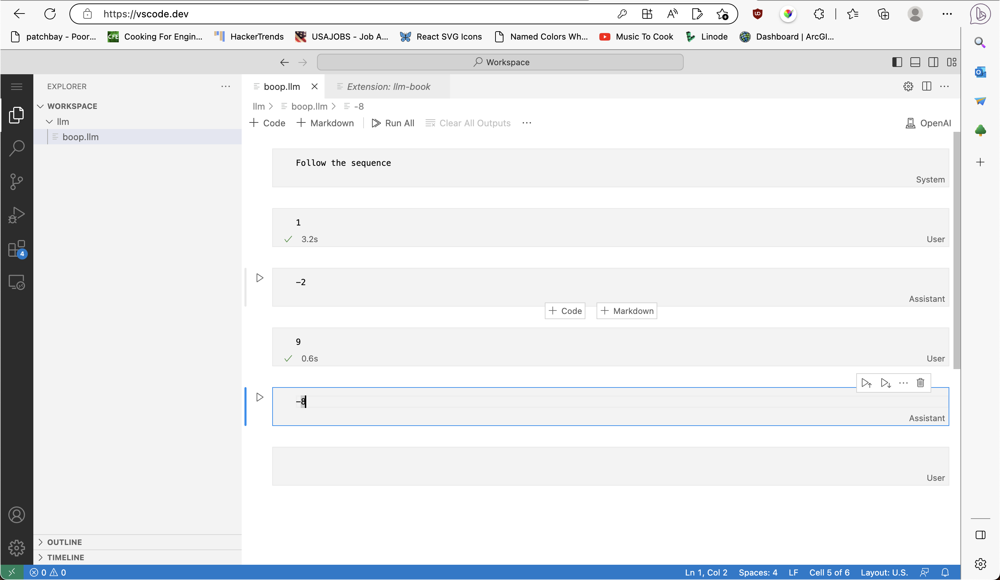
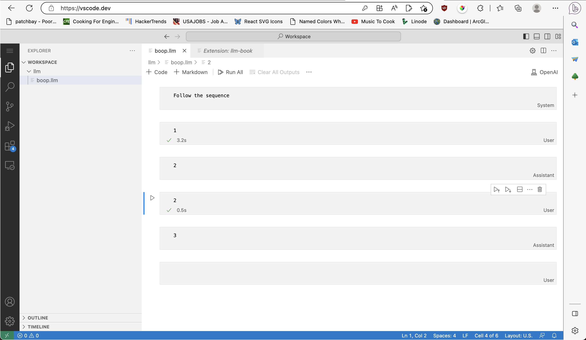
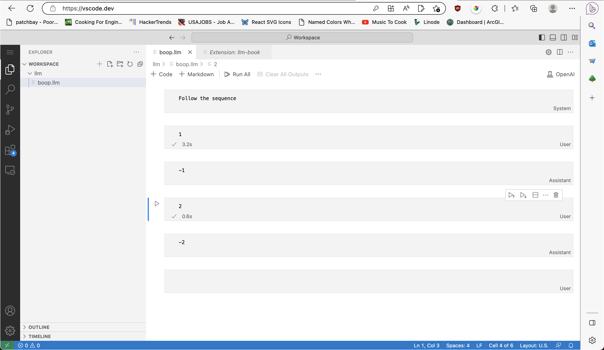

# LLMBook README

Interact with LLM's via VS Code notebooks.

To begin, make a `*.llm` file and this extension will automatically take it from there.

As compared to ChatGPT where you only have control over the `user` message, this allows for precisely tuning all of the `system`, `user`, and `assistant` messages to best suit the task at hand (aka "Prompt Engineering"):

Fun fact! The `.llm` format used by notebooks is on-disk represented in the official Open AI "Chat Format" as JSON, meaning the tuned prompt notebook files can be loaded straight from disk and incorporated with the rest of your pipeline.

## LLaMa?

There is initial support for LLaMa models (anything CLI-powered, really) but it's wonky (the prompt is echoed back in the response, for one). Also, the base LLaMa models aren't well suited for conversational settings, and do not support the `system`, `user`, `assistant` breakdown. If you are interested in furthering this support, PR's are more than welcome. Set `llm-book.LLaMa.binary` to begin.
